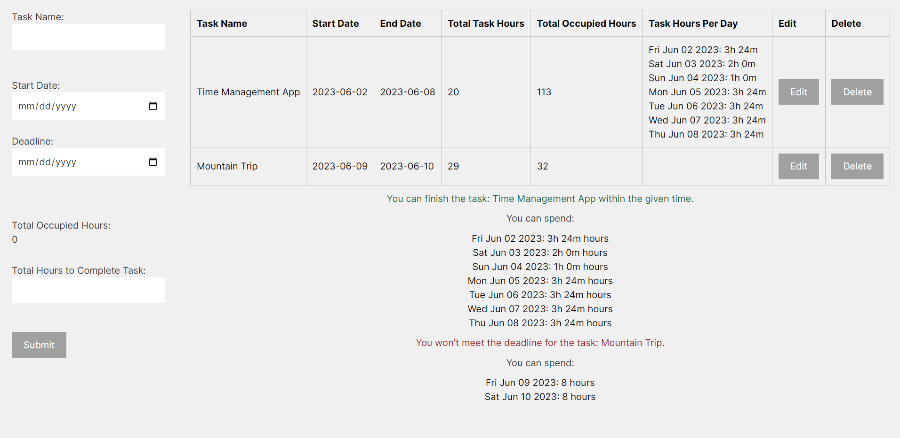

# Time Management App

[Link to live app]

[Link to Github Repository](https://github.com/MariusDevelops/time-management-app)

## About

This is a time management app built with React and Next.js. It allows users to add tasks with start dates, deadlines, and total hours to complete. The app calculates the available time for each task and displays the results in a table.

## Installation

To run this app locally, follow these steps:

1. Clone this repository to your local machine.
2. Navigate to the project directory and run `npm install` to install the dependencies.
3. Run `npm run dev` to start the development server.
4. Open [http://localhost:3000](http://localhost:3000) in your browser to view the app.

## Usage

To use the app, simply fill out the form with the task details and click "Submit". The results will be displayed in the table below.

You can edit or delete tasks by clicking the "Edit" or "Delete" buttons in the table.

## Contributing

Contributions are welcome! If you have any suggestions or improvements, feel free to open an issue or submit a pull request.

## License

This project is licensed under the [MIT License](LICENSE).
